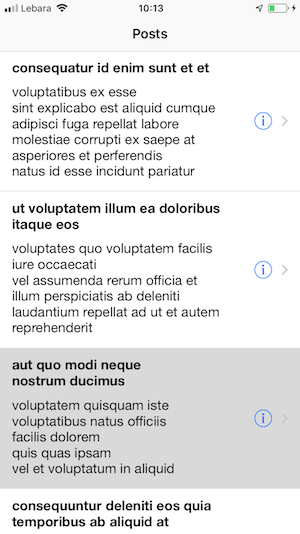
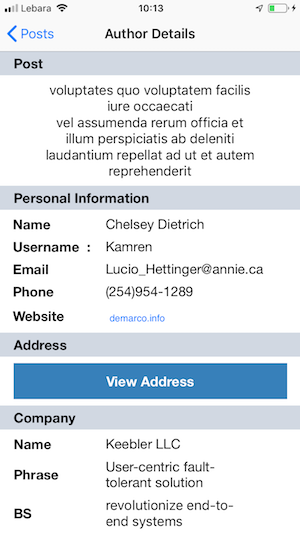
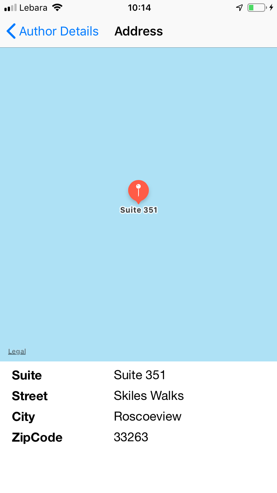

# DemoApp
This is a demo applictaion thats will display posts and the details of the from feed service.

### Prerequisites
* XCode 10 

List of posts

http://jsonplaceholder.typicode.com/posts

Details of posts

http://jsonplaceholder.typicode.com/users

The feed data fetch from service and saved to database.

Mainly three screens in this demo :- 

### View all posts

 

### Post Details

 

### Address

 

